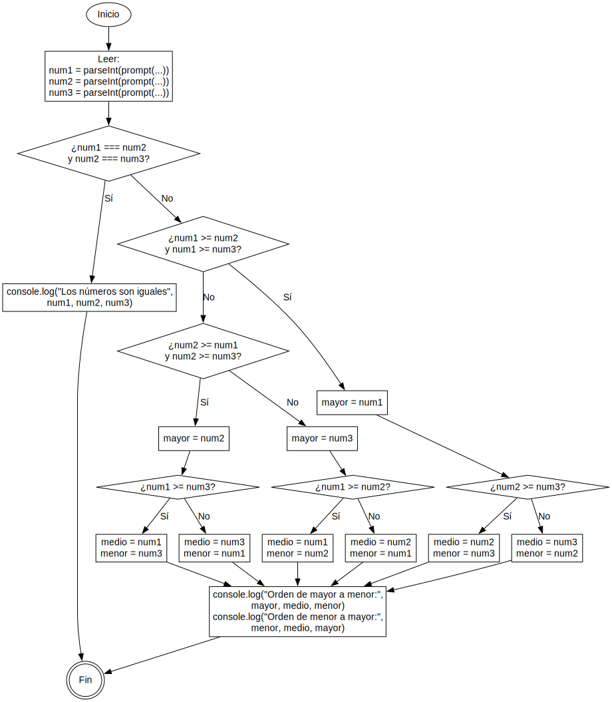

# 🧠 logica-de-programacion-1 🧑‍💻
Repositorio para la practica "35.4 - SA-PLD1 - Práctica de Comparación de Números"

## 🗣️ Descripción del problema 🧐
- Crear un programa en Javascript que realice lo siguiente:
  - Debe solicitar al usuario 3 números por prompt y guardarlos en sus respectivas variables.
  - Debe analizar los números, identificar cual es el número mayor, el número del centro y el número menor.
  - Debe imprimir los números por consola o por el DOM ordenados de mayor a menor, y de menor a mayor.
  - Debe ser capaz de identificar si los números son iguales e imprimir un mensaje por consola o por el DOM diciendo que los números son iguales.

## 👨‍🔬 Inputs para probar los resultados 🧪
- Prueba tu programa con las siguientes entradas para asegurarte que funcione correctamente:
  - Entradas:
    - 4, 4, 2.
  - Salida:
    - 4, 4, 2.
    - 2, 4, 4.
  ---
  - Entradas:
    - 4, 2, 4.
  - Salida:
    - 4, 4, 2.
    - 2, 4, 4.
  ---
  - Entradas:
    - 2, 4, 4.
  - Salida:
    - 4, 4, 2.
    - 2, 4, 4.

- Pruébalo con las combinaciones de números que se te ocurran.

## 📩 Entrega del codigo 📤
- Al final de tu práctica, tienes que subir el ejercicio a tu repositorio de GitHub.
- Colócalo en un repositorio llamado **“logica-programacion-1”**

## ☝️ Sugerencias 💡
- Recuerda convertir a number el valor solicitado por prompt y verificar que sea un número para evitar errores en tu programa.
- Recuerda que para mostrar mensajes por consola o por el DOM, debes crear un archivo HTML y enlazar tu script.
- Piensa en las posibles combinaciones de números, para ayudarte puedes desarrollar un algoritmo y el pseudocódigo.

---

# 🗺️ Planificacion ✍️
## 🎨 Diagrama de flujo 🖌️


## 📝 Pseudocódigo ✍️
```
INICIO
    LEER num1
    LEER num2
    LEER num3

    SI (num1 = num2) Y (num2 = num3) ENTONCES
        ESCRIBIR "Los números son iguales:", num1, num2, num3
    SINO
        // Declarar variables
        mayor, medio, menor

        SI (num1 >= num2) Y (num1 >= num3) ENTONCES
            mayor ← num1
            SI (num2 >= num3) ENTONCES
                medio ← num2
                menor ← num3
            SINO
                medio ← num3
                menor ← num2
            FIN SI

        SINO SI (num2 >= num1) Y (num2 >= num3) ENTONCES
            mayor ← num2
            SI (num1 >= num3) ENTONCES
                medio ← num1
                menor ← num3
            SINO
                medio ← num3
                menor ← num1
            FIN SI

        SINO
            mayor ← num3
            SI (num1 >= num2) ENTONCES
                medio ← num1
                menor ← num2
            SINO
                medio ← num2
                menor ← num1
            FIN SI
        FIN SI

        ESCRIBIR "Orden de mayor a menor:", mayor, medio, menor
        ESCRIBIR "Orden de menor a mayor:", menor, medio, mayor
    FIN SI

FIN
